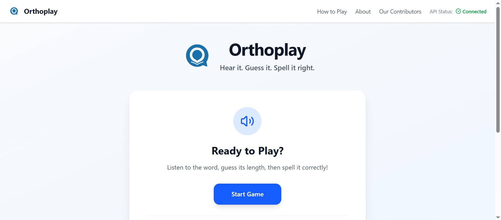

# 🎮 About Orthoplay

Orthoplay is a fun, educational web-based game designed to help users improve their vocabulary and word formation skills in a playful environment.

---

## 🔗 Project Demo

Check out how Orthoplay works in this short demo:

---
*Or try it live here: [Live Demo](https://your-live-link-if-available.com)*

---

## ✨ Features

* 🎯 **Interactive Gameplay** – Fun and challenging levels to enhance word-building skills.
* 📚 **Educational Value** – Improves vocabulary, spelling, and logical thinking.
* 📱 **Responsive Design** – Works seamlessly across devices.
* 🧠 **Real-time Feedback** – Instant validation to guide and motivate players.
* 🎨 **Clean UI** – Simple, distraction-free layout for better focus.

---

## 👥 Contributors

Thanks to all the amazing people who contribute to Orthoplay!

  

> Automatically updated with [contrib.rocks](https://contrib.rocks)

---

## 📫 Feedback & Suggestions

We’d love to hear from you!
Open an issue or pull request for feedback, bugs, or ideas.